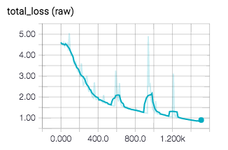

# SVHN Tensorflow Homework
This is a Tensorflow implementation of svhn classification. I am a new learner of Tensorflow which means the code may have bugs. If you like this code, improve it and teach me the improvement you make. Of cause I will improve it on the road of learning Tensorflow.
## Training Details
- **Training**: 
	```
	python svhn_data_fd.py
	```

Loss minimization:


